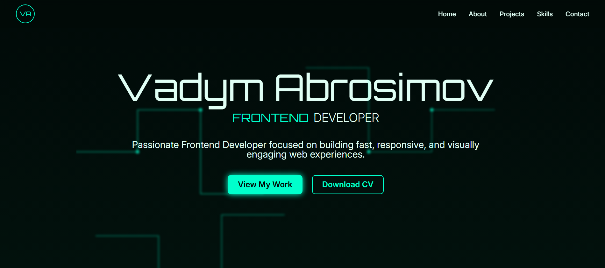

# AngularPortfolio

This is a Single-Page Application (SPA) built using the Angular framework and TypeScript to serve as my personal developer portfolio. It is designed to be fully responsive and showcase my key projects, technical skills, and professional experience through a modern, component-based architecture.



I chose Angular to demonstrate my proficiency with an enterprise-grade framework, focusing on robust code quality, modularity, and high performance. The framework allows for building complex, feature-rich web applications that reflect current industry standards. The use of TypeScript also ensures strong typing and enhanced code maintainability, emphasizing best practices in modern front-end development.

To run the application locally, you must first clone the repository and install the npm dependencies. The deployment process is fully automated for continuous integration and delivery. It uses GitHub Actions in conjunction with the angular-cli-ghpages tool, which automatically builds the production application and publishes it to GitHub Pages upon merging code to the main branch.

Required Code

```bash
# 1. Clone the repository
git clone https://github.com/vp-1591/AngularPortfolio.git

# 2. Navigate into the project directory
cd AngularPortfolio

# 3. Install dependencies and run locally
npm install
ng serve --open
```

The live application is hosted on GitHub Pages: https://vp-1591.github.io/AngularPortfolio/
